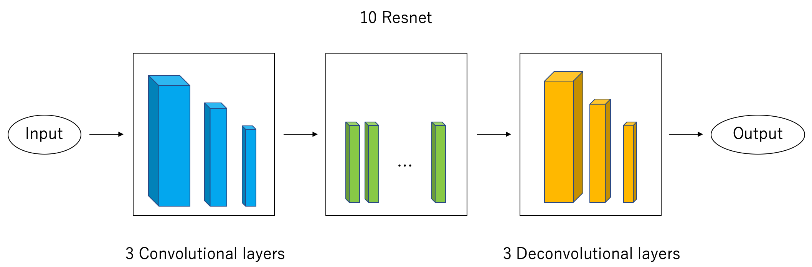

# Music-Genre-Transfer-using-CycleGAN-with-Chord-conditions

- CycleGANを用いて異なる音楽ジャンル間でのドメイン変換を実現するモデルの改良を行った。
- コード情報を学習に組み込むことでジャンル変換後の移調を抑えたり、変換精度を上げることを目的としている。
- コード情報を取得するために、tonal centroid features(調性中心特徴)を使用する。
- 評価には別で学習したジャンル分類器を使用している。

## Tonal Centroid Features

楽曲のコードを検出するために、tonal centroid features(調性中心特徴)を使用。
（音程ベクトルをTonnetzに基づき五度圏、短三度圏、長三度圏にマッピングする）

MIDIデータから１２次元の音程ベクトルを算出して、L1正規化した後、6×12の三角関数基底の変換行列をかけて、2×3次元の音程空間にマッピングします。

計算式は以下のようになる。

以下に例として音程空間上の各ルート音のメジャーコードの座標を示す。

音程空間上で入力データと各コード（メジャー、マイナー）のユークリッド距離を計算してコードを検出する。

ζは楽曲データの音程空間の座標を表し、ζ'は距離を測りたいコードの座標を表す。

## Model Architecture

本研究のモデルは、2つのGANをサイクル的に構成し学習を行っている（CycleGAN）

GenはGenerator、DisはDiscriminator、AとBは2つのジャンルを示す。青と赤の矢印は2方向のジャンル変換、黒の矢印はDiscriminatorへの入力を表す。
x、x hat、x tlideはそれぞれ、実データ、変換後のデータ、再変換後のデータを表す。

GeneratorとDiscriminatorの構造は以下のようになっている。

## Genre Classfier

ジャンル変換の精度を評価するために分類器を別で学習させる。構造は以下のようになっている。

